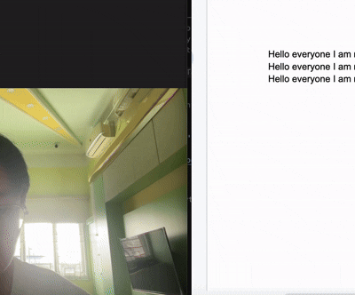

# AI Hand Gesture Keyboard Shortcuts

This is a background tool that lets you control your computer using your webcam and hand gestures. It reads your hand movements and triggers standard keyboard shortcuts (like Copy, Paste, and Undo).

Built using **OpenCV** and **MediaPipe**.

---

## 📺 Demo

---

## 🛠️ How It Works

The script captures video from your webcam, tracks 21 points on your hand, and checks which fingers are open or closed. 

### Gesture Map

| Gesture | What it does | Shortcut triggered |
| :--- | :--- | :--- |
| **FIST** | Undo | `Ctrl + Z` / `⌘ + Z` |
| **PEACE SIGN** | Copy | `Ctrl + C` / `⌘ + C` |
| **OPEN HAND** | Paste | `Ctrl + V` / `⌘ + V` |
| **THUMBS UP** | Save File | `Ctrl + S` / `⌘ + S` |
| **POINT UP** | New Browser Tab | `Ctrl + T` / `⌘ + T` |

---

## 🚀 Main Features

* **Auto-Download:** Automatically downloads the required AI model file (`hand_landmarker.task`) on the first run.
* **On-Screen Display:** Shows the hand tracking lines and current gesture status live on the video screen.
* **On/Off Switch:** Press **`e`** on your keyboard to turn gesture shortcuts on or off. Press **`q`** to quit.